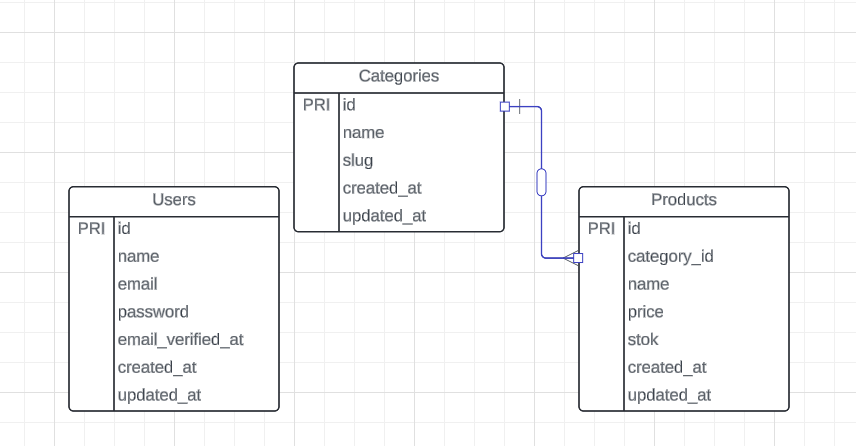
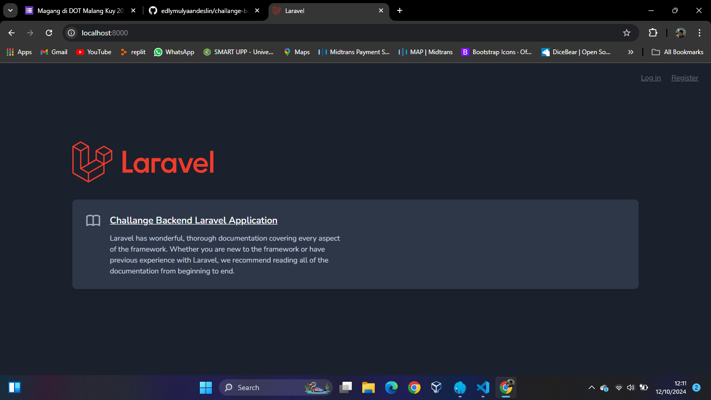

## About Application

Saya membuat aplikasi sederhana dengan menggunakan framework laravel, dimana aplikasi ini dalam mengelola 2 data table yang berelasi yaitu Category dan Product.

## About API

Endpoint API crud Category:

-   [GET] => /categories
-   [POST] => /categories
-   [GET] => /categories/{id}
-   [PUT] => /categories/{id}
-   [DELETE] => /categories/{id}

Endpoint API crud Product:

-   [GET] => /products
-   [POST] => /products
-   [GET] => /products/{id}
-   [PUT] => /products/{id}
-   [DELETE] => /products/{id}

## Desain Database

## Screenshoot Application

## License

The Laravel framework is open-sourced software licensed under the [MIT license](https://opensource.org/licenses/MIT).
